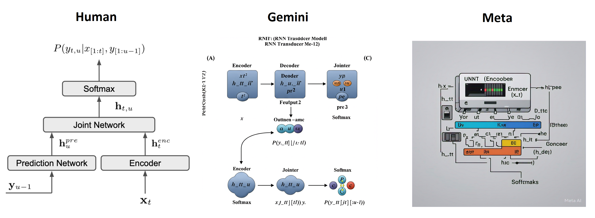

# Vietnamese Streaming RNN-Transducer

Welcome! This repo explores training an RNN-T from scratch, using the Whisper encoder as the Audio Encoder. You'll find experiments, a step-by-step tutorial, and a pretrained checkpoint trained on ~6000 hours of Vietnamese speech.

<div align="center">

<i>Visualization of RNN-T</i>
</div>
<br>

- **Try the demo 🤖**: [Check out the demo on Huggingface Spaces](https://huggingface.co/spaces/hkab/vietnamese-rnnt-demo)
- **Tutorial (Vietnamese) 📃**: [Read the detailed blog post](https://hkab.substack.com/p/streaming-rnn-transducer)

## 🗂️ What's Inside

This repository includes:
- Comprehensive training scripts
- Streaming inference scripts
- ONNX export scripts

🌟 We also share  a pre-trained streaming RNN-T model, trained on 6000 hours of Vietnamese audio (1000 labeled hours and 5000 hours labeled by *whisper-large-v3-turbo*). If you want to test the model immediately, checkout `./notebooks/inference.ipynb`.

## 🐋 Docker Setup

To ensure compatibility, we recommend using a version of PyTorch that supports `torch.nn.functional.scaled_dot_product_attention`.

```bash
git clone https://github.com/HKAB/vietnamese-rnnt-tutorial
.git

cd vietnamese-rnnt-tutorial

docker build -t pl25_rnnt .

docker run -itd --gpus all --net host --ipc=host --ulimit memlock=-1 --ulimit stack=67108864 --name YOUR_DOCKER_NAME -v /path/to/local:/wp pl25_rnnt
```

## ⚙️ Usage

### 🏋️ Training

Training an RNN-T model is highly GPU-intensive. To train using this repository with `BATCH_SIZE` of 32 and audio lengths of approximately 15 seconds, you will need around **50GB** of vRAM. Here are steps required before training:

1. **Prepare Manifests, Tokenizer**: Create training and validation manifests in NeMo format (there is a sample at `./data/sample.jsonl`) and set their paths to `TRAIN_MANIFEST` and `VAL_MANIFEST`. Then prepare a tokenizer on your text using [sentencepiece](https://github.com/google/sentencepiece).
2. **Prepare Background Noise for Augmentation**: Enhance your training data with background noise from sources like [AudioSet](https://research.google.com/audioset/download.html), [MUSAN](https://www.openslr.org/17/), and [FSDnoisy18k](https://zenodo.org/records/2529934). Set the path to these datasets in `BG_NOISE_PATH`.
3. **Get Pretrained Encoder Weights**: Download the Whisper weights from [here](https://github.com/openai/whisper/blob/main/whisper/__init__.py) to `./weights` and then run `python3 export_encoder.py` to extract the encoder weight for our use. Finally, set the encoder path to `PRETRAINED_ENCODER_WEIGHT`.
4. **Adjust Parameters**: Customize parameters related to the optimizer, scheduler, batch size, number of workers, and more to suit your needs in `constants.py`. 

### ⚡ Inference & ONNX Export

Two notebooks in the `notebooks` folder will guide you through the process.

## 📊 Performance

For more details on pros and cons of this model, please check out the tutorial.

| Model                   | WER on VIVOS (760 samples) | WER on CM17 (1274 samples) |
|-------------------------|----------------------------|----------------------------|
| RNNT Offline            | 0.1497                     | 0.0657                     |
| RNNT Online             | 0.1521                     | 0.1354                     |
| RNNT Online ONNX (FP32) | 0.1454                     | 0.1237                     |
| RNNT Online ONNX (INT8) | 0.1945                     | 0.2343                     |
| Whisper-small           | 0.2389                     | 0.2956(*)                  |
| Whisper-large-v3-turbo  | **0.094**                  | 0.1963(*)                  |

- Offline mode: We pass the whole audio, no caching. Online mode: We pass audio chunk sequentially, with caching.
- We use [Vinorm](https://github.com/v-nhandt21/Vinorm) for transcript normalization.

(*) Comparing `Whisper-small` and `Whisper-large-v3-turbo` with others on CM17 is not fair since they might not be trained on CM17, but we included them anyway.

## Example

For more examples, please visit [Huggingface Spaces](https://huggingface.co/spaces/hkab/vietnamese-rnnt-demo).

| Audio | Transcript |
|--------|------------|
| <audio controls><source src="./media/Ucraina.mp3" type="audio/mpeg"></audio> | tổng thống ukraine volozymy zelensky hôm qua tuyên bố sẵn sàng từ bỏ chức vụ nếu điều đó mang lại hòa bình cho ukraine phát biểu tại diễn đàn ukraine năm 2025 tổng thống zelensky cho biết ông có thể từ chức để ukraine gia nhập nato tổng thống zelensk cũng bày tỏ mong muốn tổng thống mỹ donald trump trở thành đối tác của ukraine còn về vấn đề nợ nần tổng thống zelensky khẳng định là ukraine từ chối thừa nhận khoản nợ 500 tỷ usd với mỹ và cho rằng không nên coi các khoản viện trợ là các khoản vay tại hàn trung quốc đã có hơn 5,5 triệu lượt khách nước ngoài sử dụng dịch vụ vận tải đơn sát tại hàn quốc trong năm qua tập đoàn đường sát hàn quốc hôm qua công bố con số này đã tăng 61% so với mức là hơn 3,4 triệu lượt vào năm 2023 nguyên nhân là do dịch vụ bán vé cho người nước ngoài được cải thiện đồng thời mở rộng việc sử dụng thể đi tàu cung cấp dịch vụ thông đi lại không giới hạn trong khu vực thủ đô seoul tại trung quốc đội cứu hỏa và cứu hộ thanh đảo ở tỉnh sơn đông đã vừa bổ sung 2 con robot chữa cháy mỗi con robot nặng khoảng 70 cân di chuyển tối đa là 5m trên giây hoạt động liên tục trong vòng hơn 3 giờ robot có thể tự đứng dậy và cân bằng sau khi ngã di chuyển tự do trong môi trường nguy hiểm với khói dày và nhiệt độ cao cũng như là khí độc robot có cảm biến khí hệ thống quét la re nhanh để phát hình quay trực tiếp để giúp chỉ huy giám sát việc cứu nạn cứu hộ từ xa một chuyến bay của hãng hàng không mỹ eamon airlines new york đến new del sự ấn độ đã phải chuyển hướng hạ cánh khẩn cấp tại chrome của italy vào ngày hôm qua sau khi nhận được thông tin đe dọa đánh bom chiếc máy bay boeing chở 199 hành khách cùng phi hành đoàn đã hạ cánh an toàn vào lúc 17h22 giờ rời địa phương tức là tối qua theo giờ việt nam tất cả hành khách đã được sơ tán khỏi máy bay và được hỗ trợ tại sân bay chuyến bay sẽ tiếp tục bay đến new delhi trong ngày hôm nay |
|||
## 🤝 Contributing

We welcome any contributions! Feel free to open issues or submit pull requests to improve this project.

## ⚖️ License

This project is licensed under the [Apache License 2.0](https://www.apache.org/licenses/LICENSE-2.0).